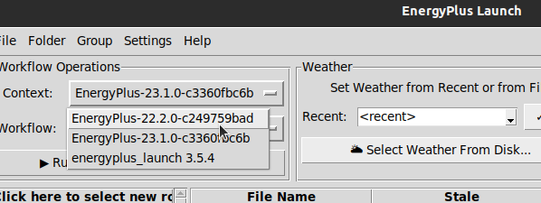

EnergyPlus Mechanics
====================

While EP Launch is intended to be a general-purpose workflow program, it is obviously geared heavily toward EnergyPlus.
The EnergyPlus-specific workflows live in the `EnergyPlus repository <https://github.com/NREL/EnergyPlus>`_.
This document covers the few details about EnergyPlus operation that live inside EnergyPlus-Launch itself.

Detecting Installed EnergyPlus Versions
---------------------------------------

To make the process as simple as possible for a user, EnergyPlus-Launch attempts to detect installed versions of EnergyPlus.
During the first launch of the tool (or any time the configuration has been cleared), the following roots are searched:

- Windows: ``?:\\`` (where ? is all 26 letters, to search on all possible drives)
- Linux: ``/usr/local/bin/``
- Mac: ``/Applications/``

Inside any of these roots, the tool searches for the following folder names:

- ``"EnergyPlus*"``
- ``"energyplus*"``
- ``"EP*"``
- ``"ep*"``
- ``"E+*"``
- ``"e+*"``

If any of these are detected, the program will make one final search for a ``workflows`` folder inside the E+ install.
If that directory is found, the workflows will be automatically imported into EnergyPlus-Launch.
If that directory is not found, such as for versions of EnergyPlus older than 9.1, EnergyPlus-Launch cannot do anything with that install, and it will be skipped.

Handling Multiple EnergyPlus Versions
-------------------------------------

Multiple versions of EnergyPlus workflows can be configured simultaneously.
When used in conjunction with the favorite/recent folder menu, this allows easy running of multiple versions rapidly.
Multiple versions of EnergyPlus will appear in the workflow context menu just like any other type of tool.
This is visualized here:

Note how the EnergyPlus version is shown, along with the build hash.
This is helpful for developers of EnergyPlus who may have many different builds of the same version.
