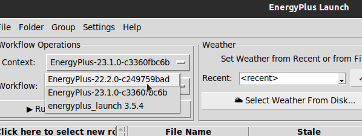

EP-Launch
=========

This document provides an introduction to EP-Launch, a Quickstart guide for users, and setup instructions for developers.

The code for EP-Launch is hosted on `Github <https://github.com/NREL/EP-Launch>`_.
Known issues are on the `Issue Tracker <https://github.com/NREL/EP-Launch/issues>`_.

What is it?
-----------

EP-Launch is a tool that has been distributed with the EnergyPlus building simulation engine for decades.
It was originally written in Visual Basic 6, and has been maintained and updated as a Windows only program.
There was also an EP-Launch Lite tool for Mac, but was an extremely minimal tool.
Recent pushes to update the tool to become cross platform and adopt a modern programming language led to a major rewrite in 2018.
The release of EP-Launch 3.0 in 2018 brings an entirely new codebase and an entirely new tool.
While some of the features from the prior EP-Launch have not been integrated yet, the capabilities of the new version have a much higher ceiling.

Starting with EP-Launch 3.0, the tool now runs "workflow" scripts, which are Python classes, instead of relying on run code being hardwired inside EP-Launch.
These workflows can be written by users for their own tools, and users can modify the existing ones in an EnergyPlus installation.
This allows users to adjust the way EnergyPlus or other tools run in EP-Launch without needing an understanding of VB6 and a VB6 compiler.
The workflows have their own documentation here :ref:`Workflows`.

In addition, a new feature of EP-Launch 3.0 is the use of caching.
When a workflow is started, a small json file is created in that working folder.
Initially that json file contains input parameters that define that run.
When a workflow is complete, the background processes update that cache file, and the GUI can refresh with this new data.
In the GUI, when you browse to a folder, the cache file in that folder is searched, and if results match the currently selected workflow, the result data is populated.
Cache files are a difficult thing to manage considering any number of threads could be trying to access the file as workflows are completed.
Users aren't required to understand all the intricacies for normal operation of the program, but they are documented here: :ref:`Cache File Operation`.

Here are some general highlights of the project for those interested:

- `Python <http://www.python.org/>`_. desktop application
- Developed on `Github <https://github.com/NREL/EP-Launch>`_
- Tested on `GitHub Actions <https://github.com/NREL/EP-Launch/actions>`_ for all platforms
- Packaged using standard Python mechanics and posted to `PyPi <https://pypi.org/project/energyplus-launch/>`_
- Documentation built around `Sphinx <http://www.sphinx-doc.org/en/master/>`_ and published on `ReadTheDocs <https://ep-launch.readthedocs.io/en/latest/>`_

Quickstart
----------

To get started, simply:

- Install EP-Launch using Pip into the Python environment of your choice (for more info, see https://python.land/virtual-environments/installing-packages-with-pip)
- Run EP-Launch using standard Python mechanics, such as ``python3 -m eplaunch``
- Browse to a folder with an IDF
- Make sure the EPLaunch workflow context is selected (see Figure below)
- Run the built-in File Details workflow, note the dialog shows output messages and the interface has results in it
- Browse to a different folder and come back -- the data persisted through the cache file

Switching between workflow contexts, such as between the built-in EP-Launch workflows, and EnergyPlus-specific workflows, use the context dropdown, as shown here:

Although EP-Launch is packaged up with some built-in workflows, the power of EP-Launch is exercised through using workflows with external tools.
As EP-Launch has historically been geared toward supporting EnergyPlus, this is the natural first starting point.
Download and install EnergyPlus from their Github `Release Page <https://github.com/NREL/EnergyPlus/releases/latest>`_.
You will then need to inform EP-Launch of the newly available workflows using the Settings-Workflow Directories dialog.
If you installed EnergyPlus into a standard location, you can simply auto-find the workflows.
If you installed in a custom location, simply add a new workflow directory and point it to the EnergyPlusInstall/workflows directory.

As of this writing, the EnergyPlus packages will come with workflows for running:

- EnergyPlus itself (along with pre- and post-processors), in both SI and IP unit conventions
- The CalcSoilSurfTemp ground temperature calculator
- The CoeffConv conversion utility
- The CoeffCheck unit utility
- The AppendixG post processor

Once EP-Launch is ready with workflows, simply select a workflow from the list.
The available files in the control file list will filter down to the file extension defined by the workflow.
If the workflow is applicable to ``*.txt`` files, then only text files in the currently selected file will be shown.
As a quick start, browse to the EnergyPlus install folder, into the weather directory.
Then select the ``CalcSoilSurfTemp`` workflow from the dropdown or menu bar.
Select a weather file in the file listing, and click Run in the toolbar or menu bar.
The program should start and run instantly, and the column data in the file listing will be updated with output parameters.
