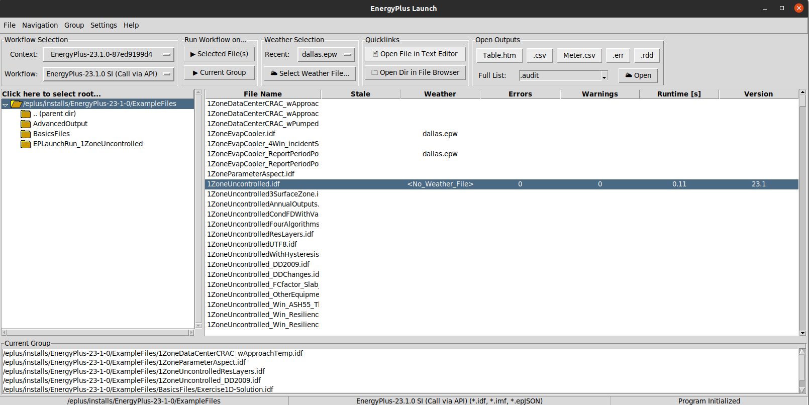

File/Folder Navigation
======================

EnergyPlus-Launch includes several ways to navigate between files and folders.

Basic Navigation
----------------

The most basic form of navigation is simply to click around through the folders and files.
The interface includes a tree of the current root directory on the left side, and a list of applicable files on the right.
If a file is missing on the right side, it is almost certainly because it is not applicable with the currently selected workflow.
In this figure, the root directory is ``/eplus/repos/8eplus/testfiles``.
The left side shows the subdirectory tree inside this root, and the right side shows the files in the currently selected directory which are applicable to the current workflow.
Since this workflow is an EnergyPlus run, it is showing only the IDF, IMF, and EpJSON files.

To select a new folder, you can simply click a folder name in the left to quickly see files there.
To advance up to a parent directory, choose the ``.. (parent dir)`` item in the directory tree.
To set a new root, simply double click the folder name in the left.
Alternatively, to set a new root using a selection dialog, click the directory tree header which says **Click here to select root...**

Recent Folders
--------------

EnergyPlus-Launch keeps track of the last few folders to which the user has navigated.
If the user selects a folder and quickly wants to get back to the last folder, it will be available in the top menu under Navigation->Recent, as shown in the following figure:

There is also a shortcut to go back to the previously selected folder, which uses the shortcut Ctrl-z.

Favorite Folders
----------------

EnergyPlus-Launch allows the user to persist a list of favorite folder locations.
If a user regularly works in a small set of folders, this can be an easy way to keep a constant list of folders in the program at all times.
At any time, the user can select a new root directory from the list of folders as shown in the following figure:

The user can add and remove the current root folder from the list by using the menu options also shown in the figure.

EnergyPlus-Launch Groups
------------------------

In addition to a single persistent favorites list, EnergyPlus-Launch also supports the ability to save customized groups of files.
Groups provide a quick list of files to run, and can be manipulated inside the application, or generated from outside.
Groups can be saved and opened so that power users who may want a more "session-based" environment can easily manage different group files for different projects.
When a user double clicks a file location from the groups entry, it will navigate to that folder and attempt to select that file as well.
The groups list is on the bottom of the window, as shown here:

Management of the group happens through the Group options shown, and is generally straight-forward.
Groups are saved as epg3 files, which are simply a list of file locations in a plain text file.
These could be created externally and just loaded into EnergyPlus-Launch for a given session.
Note that EnergyPlus-Launch does not do any background checks on whether the entries of a group currently exist, but will warn if you try to run an invalid entry.
A keyboard shortcut is available which allows the user to cycle through all entries of a group, using Ctrl-m.

Once a group is in place, running the entire group of files with the currently selected workflow can be executed from the correct button on the top bar.
A keyboard shortcut is also available to run the current group of files with the currently selected workflow, using Ctrl-g.
Note that EnergyPlus-Launch is just going to try to execute them directly, with minimal validation.
If you change workflows, the current group of files may no longer be valid.

Keyboard Navigation
-------------------

Keyboard navigation will be enhanced as needed allow power users to navigate more heavily from the keyboard.
This will include cycling through group and favorite locations.
For now, the following keybindings are supported on the interface:

F5
    Refresh the file listing
Ctrl-w
    Load the weather selection dialog for the current file selection
Ctrl-r
    Run the currently selected workflow for the current file selection
Ctrl-g
    Run the currently selected workflow for the current file group
Ctrl-m
    Cycle through navigation entries in the current group
Ctrl-z
    Go back to the previously selected folder
