## NFP Cross-Platform Implementation of EP-Launch

EP-Launch Lite that is distributed on non-Windows installs of EnergyPlus is not functionally equivalent to EP-Launch on Windows. Specifically, it does not support the same utilities or options. Also, EP-Launch has not had a significant Graphical User Interface (GUI) update in many years. The subcontractor, in collaboration with the NREL EnergyPlus development team, shall create a cross-platform EP-Launch utility, in a language, and using libraries, that can easily be packaged and delivered with an EnergyPlus installer. The new utility shall support all relevant utilities and options as the current Windows-only EP-Launch utility. The subcontractor shall propose, design, and deliver code, documentation, and accompanying tests for a cross platform launch tool for EnergyPlus.
The Subcontractor shall deliver the following:

1. Initial design, completed through a meeting to determine language, graphics library, other libraries
2. Second design, completed through a meeting to determine all specific EnergyPlus options and utilities to support
3. Initial skeleton codebase with functional testing, documentation, and distribution
4. Alpha release supporting minimal capabilities
5. Beta release supporting full capabilities
6. Final release and packaging inside the EnergyPlus installer

### Approach

Create a modern tool that can be distributed on all platforms that does all (or almost all) of the functions that the current EP-Launch on Windows does plus new features. 

Must Haves:

- Simple transition for existing EP-Launch and EP-Launch-Lite users
- Simple for new users to run simulations, open IDF input files, and output files.
- Support running multiple simulations and queueing of simulations
- Support running utilities that ship with EnergyPlus
- Uses EnergyPlus CLI instead of batch files
- Makes resimulating recently used files very easy
- Automatic warning if IDF file is from previous version of EnergyPlus
- Easy to update a files from a previous version of EnergyPlus
- Support for upcoming JSON file format
- Opens EnergyPlus documentation
- Prompts user when new versions of EnergyPlus are available and allow user to manually check for new versions
- Allow user to select viewer and editor for all file types

## Language and Library

Python was decided as the language to use. Several graphics libraries were considered including pyGTK, pyGObject, wxPython, and TkInter. The evaluation criteria used for selecting the library included:

- cross platform
- native look and feel on each platform
- easily downloaded for development
- easily packaged for distribution
- the necessary GUI components 
- well supported ecosystem
- compatible open source license
- able to build on Travis CI in reasonable time

After considering several options wxPython was chosen. The wxPython library support the latest version of Python, version 3.6, so that will also be used. The latest version of wxPython will be used which is 4.0.0b2.

The ultimate delivery of EP-Launch needs to be as a stand alone application so a freeze package such as py2exe, Cx_freeze, or pyInstaller will be used to generate that.

## Flexible Architecture 

The architecture for the program will be structured to allower users and other developers to easily add functionality based on the file extension of the file being selected. This flexiblity will allow other preprocessors, simulation programs, utilities, postprocessors, and output file viewers to be used. These other software programs will be supported by text files that describe the command line needed to run the program along with the file extensions for input and output files.

## Initial GUI

The following shows a concept of the initial GUI:

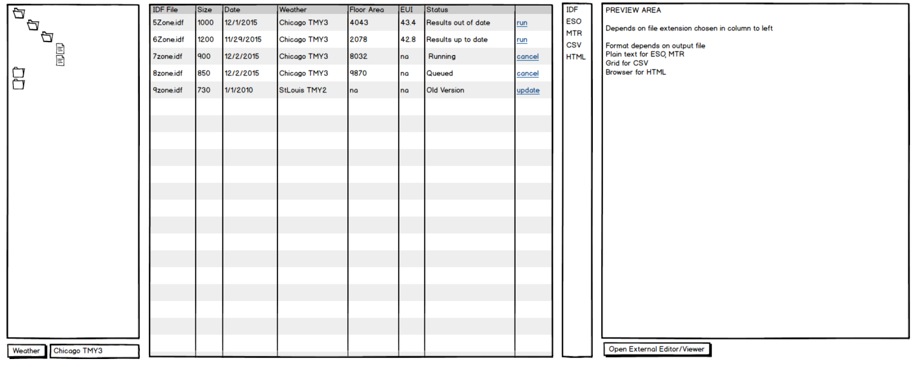

## Workflow

Information about each workflow will be stored in a text editable file (probably YAML) in a Workflow subdirectory (c:\EnergyPlusV8-9-0\Workflow) and will contain information to run a program plus all the specifications on what happens before and after and how the workflow is displayed in the EP-Launch interface. This approach will let other developers and power users make custom workflows for their projects.

The workflow files would need to contain:

- Name: Name of the workflow (maybe that is just the name of the file)
- Help: 
  + Info: <string> “Docstring” for the workflow that shows up when hovering over the workflow selector
  + Menu: <names of files> What help files should appear in the help menu and help icon
- EnergyPlus
  + MinVersion <version string> (for example 8.6.0)
  + MaxVersion <version string> (for example 8.9.0 – probably not used very often)
- Extensions: 
  + Input: <strings> Input file extension(s)
  + Output: <strings> Output file extension (which all get deleted prior to running workflow – listed in the default order for the output toolbar)
  + OutputIcon:<filepath>
- CommandToolbar:
  + UseSelectFile: <Boolean>
  + SelectFileName: <string> (usually weather)
  + UseIDFEditor:<Boolean>
  + UseTextEditor:<Boolean>
  + UseCustomEditor:<Boolean>
  + CustomEditor: <file path>
  + CustomEditorIcon: <filepath>
- Workflow Option
  + Parameter <string>
  + PossibleValues <strings>
  + Help <string>
- Command lines:
  + DirectoryScanner: <command line with optional parameters> (usually to check versions)
  + BeforeRun: <command line with optional parameters> (can be repeated)
  + Run: <command line with optional parameters> (EnergyPlus,etc..)
  + AfterRun <command line with optional parameters>
  + ResultExtractor <command line with optional parameters>
  + CrashDetector <command line with optional parameters>
- Column: (can be repeated, in default order)
  + Heading: <string>
  + Key:<string> (used with the ResultExtractor)
  + DefaultVisible: <boolean> 
  + Flag: (can be repeated)
  + Expression: <string or logical expression> (can be used to highlight cell or maybe row)
  + Color: <string> (color to change cell)

## Existing EP-Launch Screen Shots

For reference the following shows the screen shot sof the current version of EP-Launch which shows many of the features that are available with the current version.

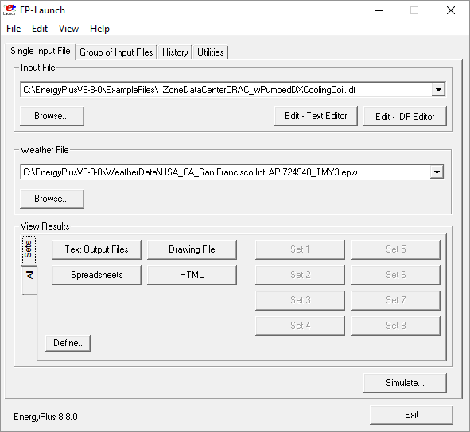

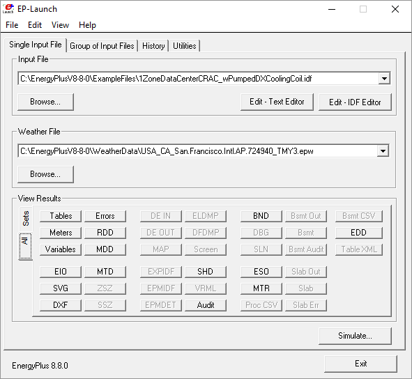

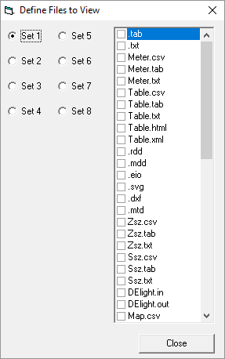

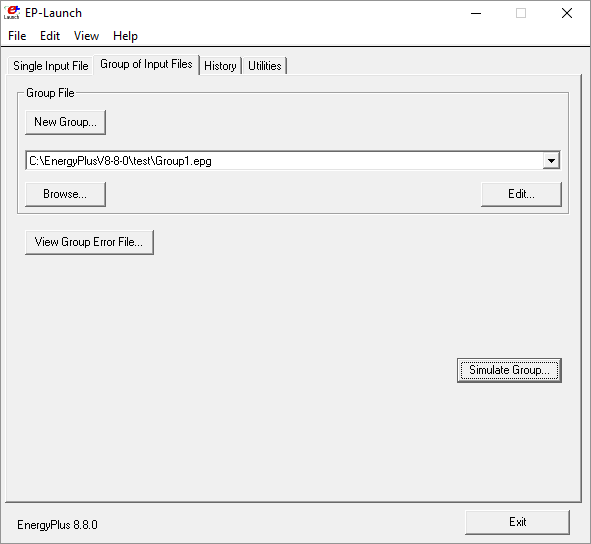

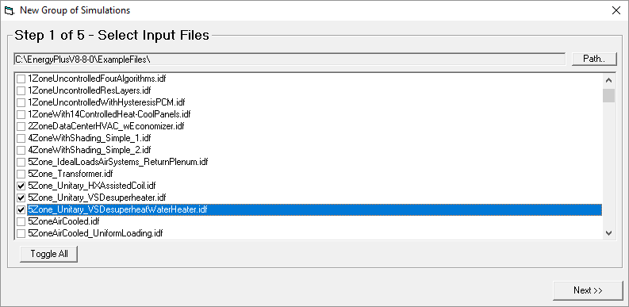

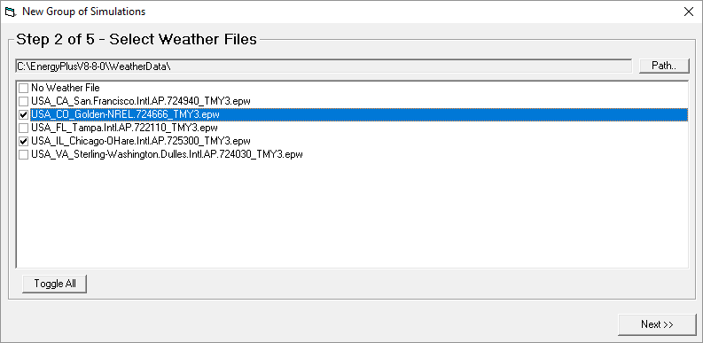

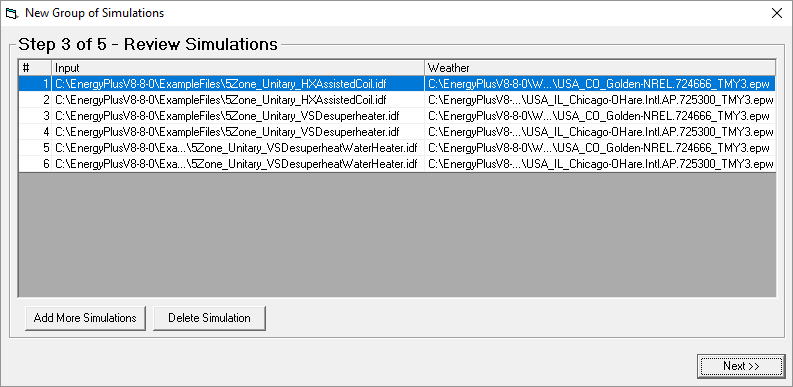

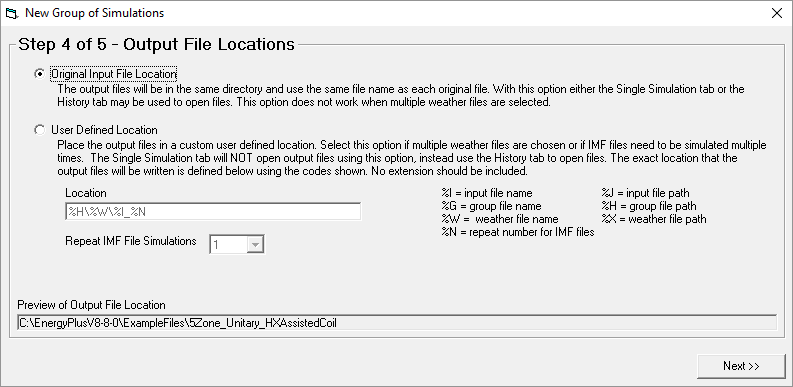

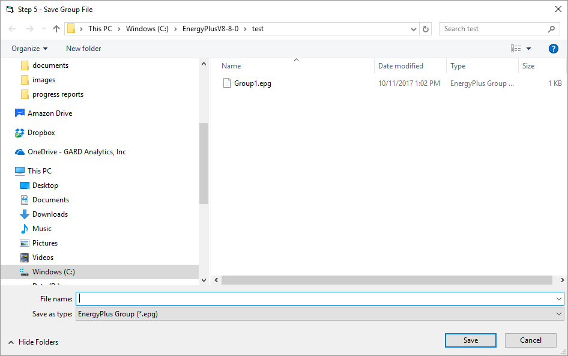

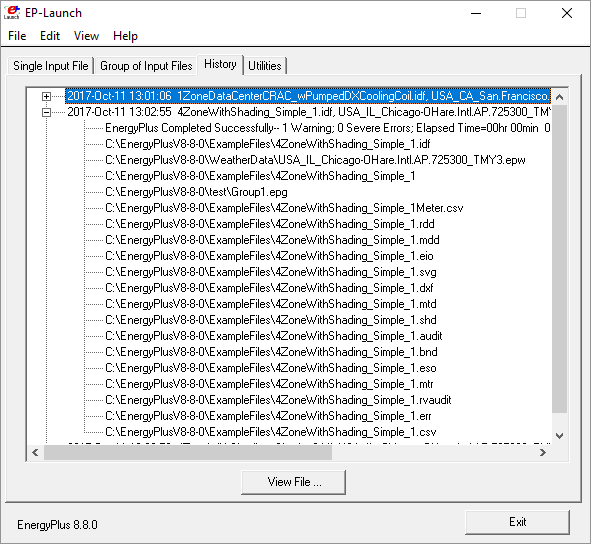

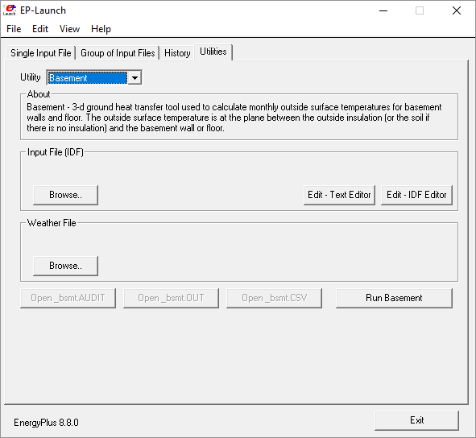

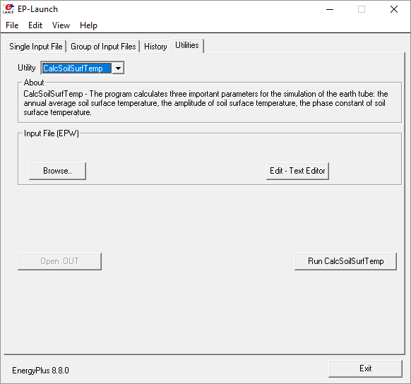

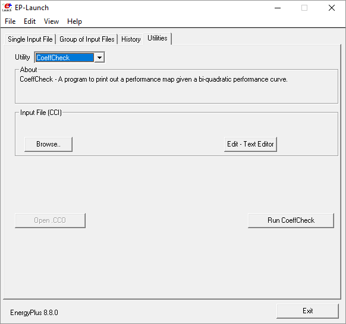

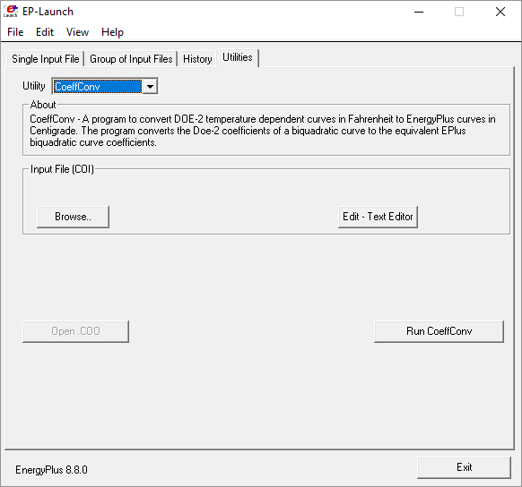

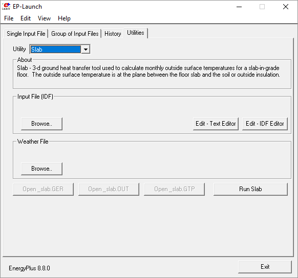

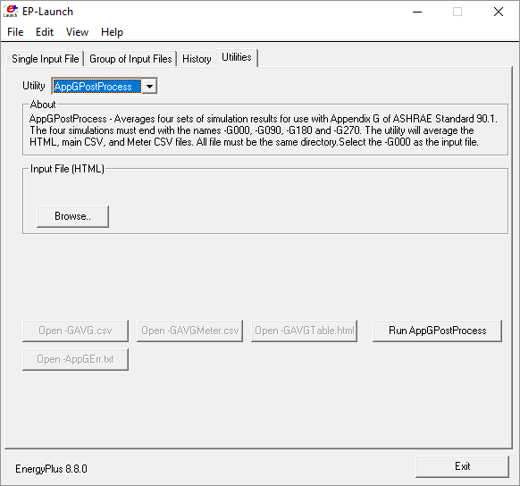

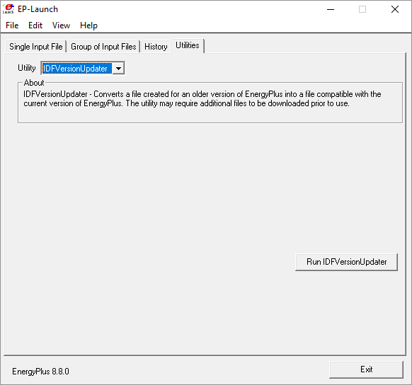

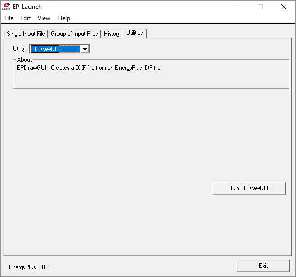

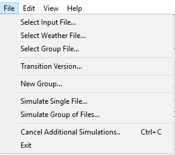

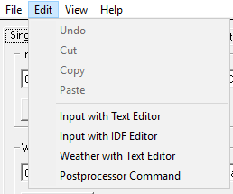

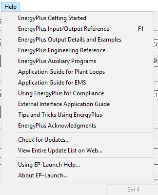

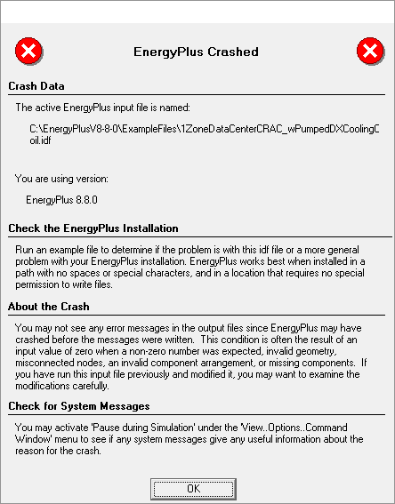

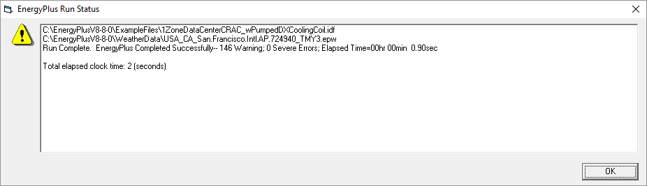

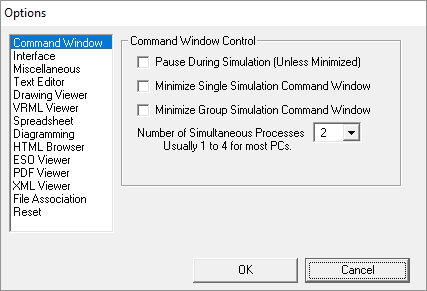

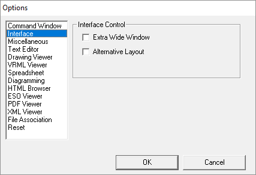

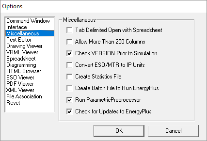

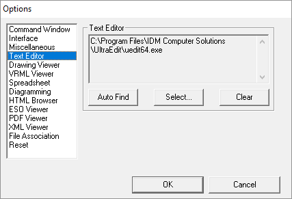

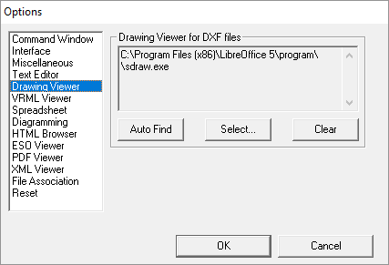

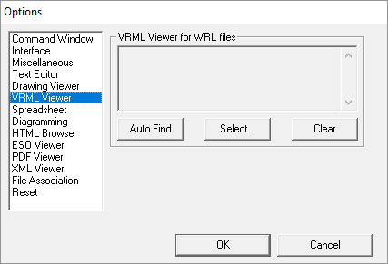

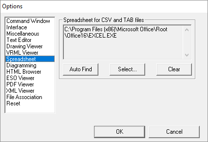

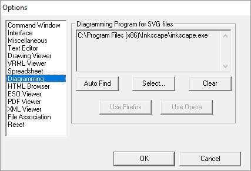

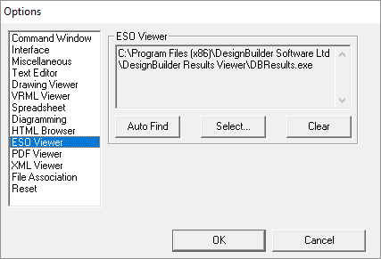

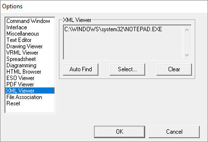

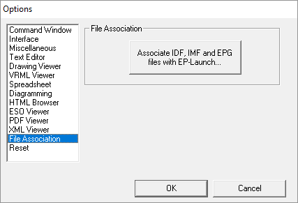

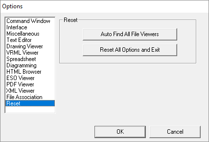

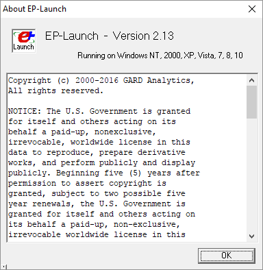

