## NFP Cross-Platform Implementation of EP-Launch

EP-Launch Lite that is distributed on non-Windows installs of EnergyPlus is not functionally equivalent to EP-Launch on Windows. Specifically, it does not support the same utilities or options. Also, EP-Launch has not had a significant Graphical User Interface (GUI) update in many years. The subcontractor, in collaboration with the NREL EnergyPlus development team, shall create a cross-platform EP-Launch utility, in a language, and using libraries, that can easily be packaged and delivered with an EnergyPlus installer. The new utility shall support all relevant utilities and options as the current Windows-only EP-Launch utility. The subcontractor shall propose, design, and deliver code, documentation, and accompanying tests for a cross platform launch tool for EnergyPlus.
The Subcontractor shall deliver the following:

1. Initial design, completed through a meeting to determine language, graphics library, other libraries
2. Second design, completed through a meeting to determine all specific EnergyPlus options and utilities to support
3. Initial skeleton codebase with functional testing, documentation, and distribution
4. Alpha release supporting minimal capabilities
5. Beta release supporting full capabilities
6. Final release and packaging inside the EnergyPlus installer

### Approach

Create a modern tool that can be distributed on all platforms that does all (or almost all) of the functions that the current EP-Launch on Windows does plus new features. 

Must Haves:

- Simple transition for existing EP-Launch and EP-Launch-Lite users
- Simple for new users to run simulations, open IDF input files, and output files.
- Support running multiple simulations and queueing of simulations
- Support running utilities that ship with EnergyPlus
- Uses EnergyPlus CLI instead of batch files
- Makes resimulating recently used files very easy
- Automatic warning if IDF file is from previous version of EnergyPlus
- Easy to update a files from a previous version of EnergyPlus
- Support for upcoming JSON file format
- Opens EnergyPlus documentation
- Prompts user when new versions of EnergyPlus are available and allow user to manually check for new versions
- Allow user to select viewer and editor for all file types

## Language and Library

Python was decided as the language to use. Several graphics libraries were considered including pyGTK, pyGObject, wxPython, and TkInter. The evaluation criteria used for selecting the library included:

- cross platform
- native look and feel on each platform
- easily downloaded for development
- easily packaged for distribution
- the necessary GUI components 
- well supported ecosystem
- compatible open source license
- able to build on Travis CI in reasonable time

After considering several options wxPython was chosen. The wxPython library support the latest version of Python, version 3.6, so that will also be used. The latest version of wxPython will be used which is 4.0.0b2.

The ultimate delivery of EP-Launch needs to be as a stand alone application so a freeze package such as py2exe, Cx_freeze, or pyInstaller will be used to generate that.

## Flexible Architecture 

The architecture for the program will be structured to allower users and other developers to easily add functionality based on the file extension of the file being selected. This flexiblity will allow other preprocessors, simulation programs, utilities, postprocessors, and output file viewers to be used. These other software programs will be supported by text files that describe the command line needed to run the program along with the file extensions for input and output files.

## Initial GUI

The following shows a concept of the initial GUI:

## Current GUI 

As of March 20, 2018.

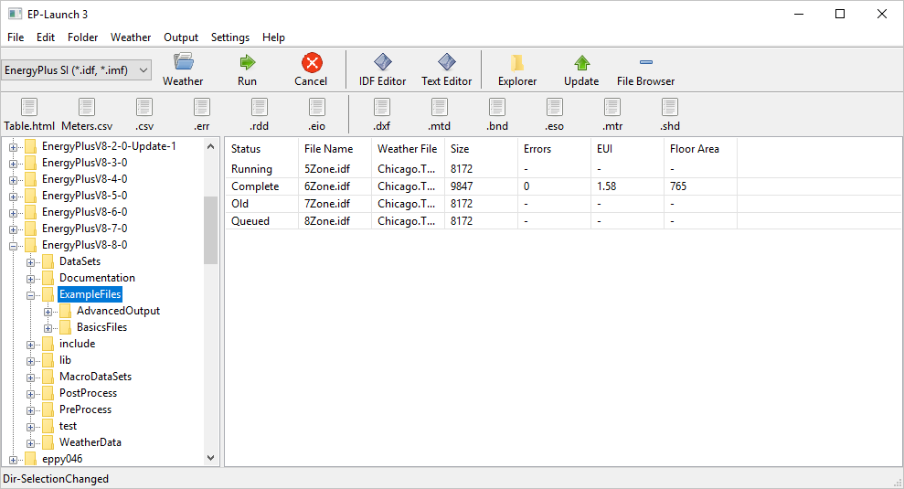
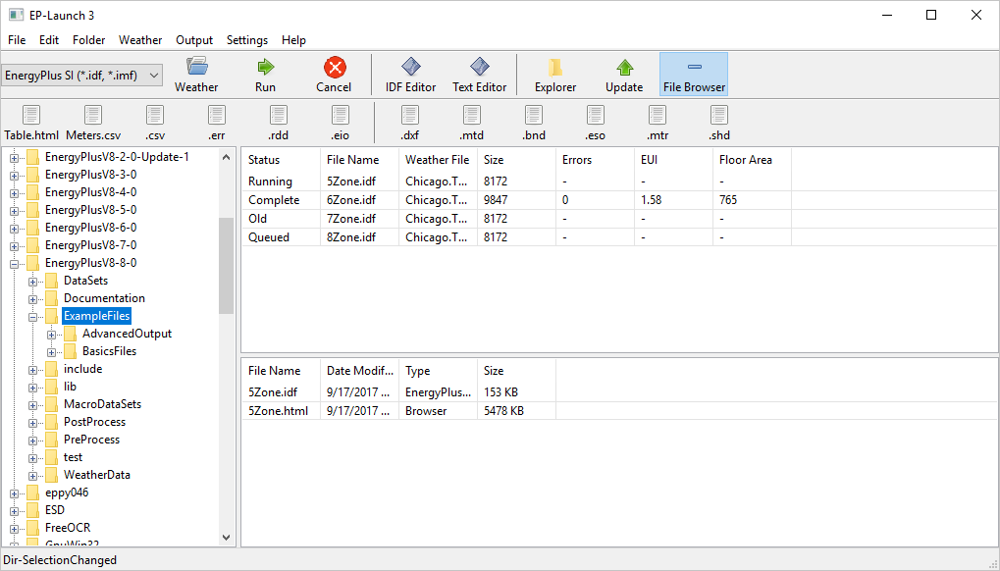
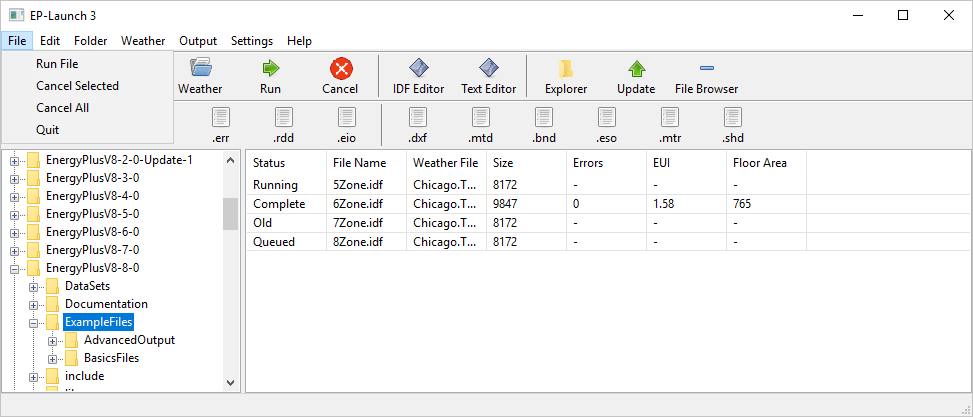
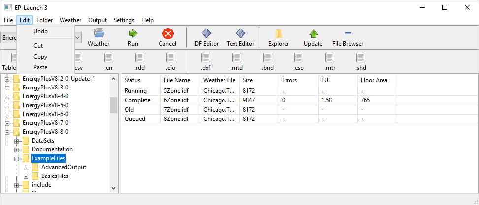

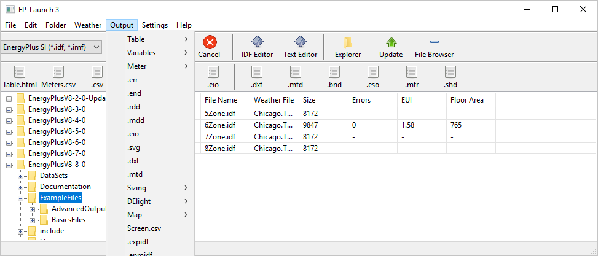
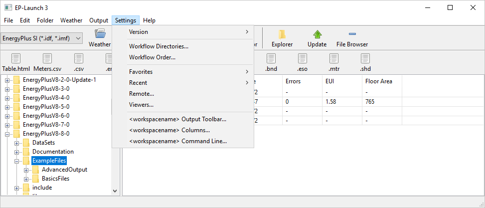
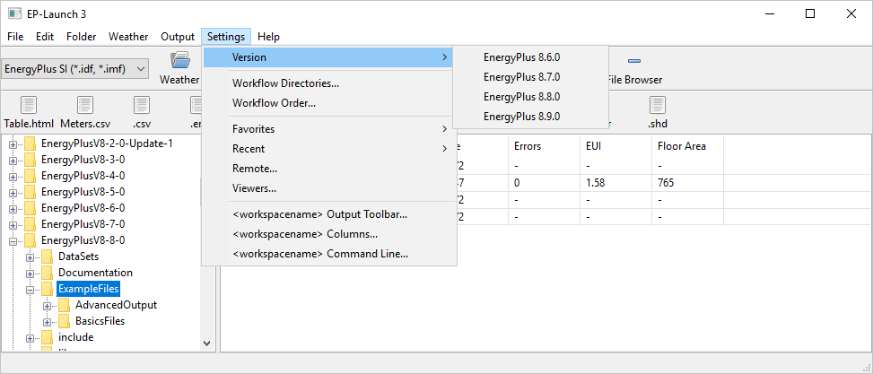
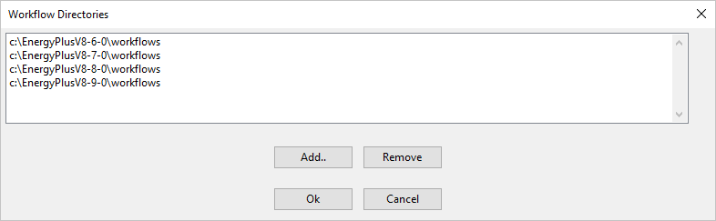
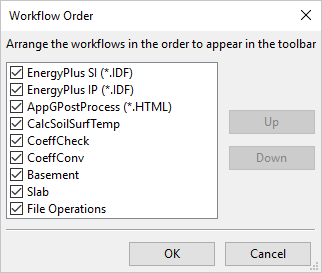
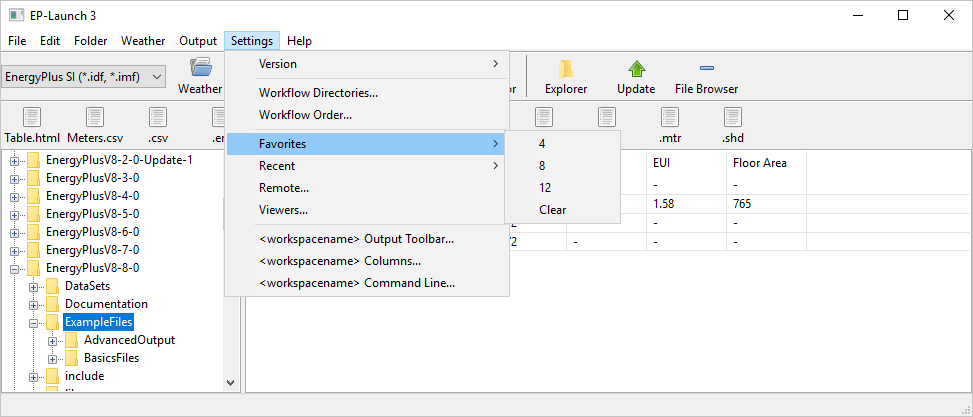
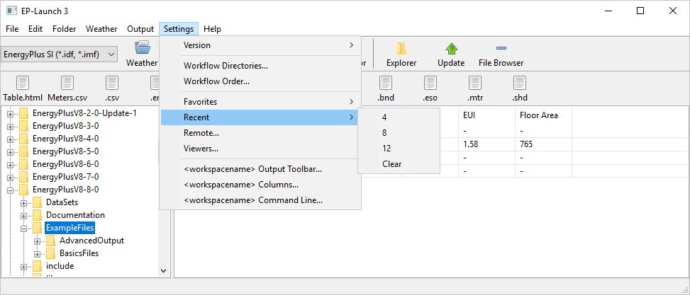
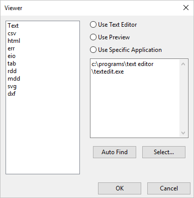
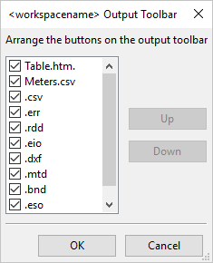
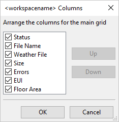
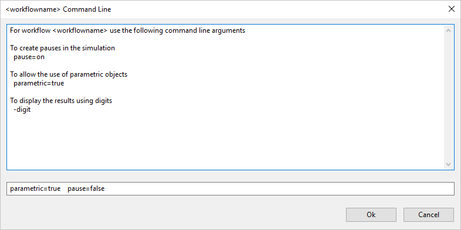
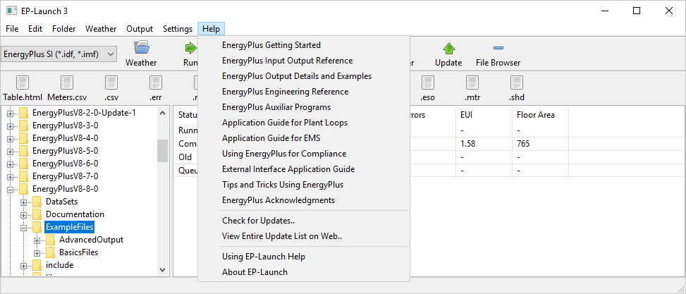

## Workflow

Information about each workflow will be stored in a text editable file (probably YAML) in a Workflow subdirectory (c:\EnergyPlusV8-9-0\Workflow) and will contain information to run a program plus all the specifications on what happens before and after and how the workflow is displayed in the EP-Launch interface. This approach will let other developers and power users make custom workflows for their projects.

The workflow files would need to contain:

- Name: Name of the workflow (maybe that is just the name of the file)
- Help: 
  + Info: <string> “Docstring” for the workflow that shows up when hovering over the workflow selector
  + Menu: <names of files> What help files should appear in the help menu and help icon
- EnergyPlus
  + MinVersion <version string> (for example 8.6.0)
  + MaxVersion <version string> (for example 8.9.0 – probably not used very often)
- Extensions: 
  + Input: <strings> Input file extension(s)
  + Output: <strings> Output file extension (which all get deleted prior to running workflow – listed in the default order for the output toolbar)
  + OutputIcon:<filepath>
- CommandToolbar:
  + UseSelectFile: <Boolean>
  + SelectFileName: <string> (usually weather)
  + UseIDFEditor:<Boolean>
  + UseTextEditor:<Boolean>
  + UseCustomEditor:<Boolean>
  + CustomEditor: <file path>
  + CustomEditorIcon: <filepath>
- Workflow Option
  + Parameter <string>
  + PossibleValues <strings>
  + Help <string>
- Command lines:
  + DirectoryScanner: <command line with optional parameters> (usually to check versions)
  + BeforeRun: <command line with optional parameters> (can be repeated)
  + Run: <command line with optional parameters> (EnergyPlus,etc..)
  + AfterRun <command line with optional parameters>
  + ResultExtractor <command line with optional parameters>
  + CrashDetector <command line with optional parameters>
- Column: (can be repeated, in default order)
  + Heading: <string>
  + Key:<string> (used with the ResultExtractor)
  + DefaultVisible: <boolean> 
  + Flag: (can be repeated)
  + Expression: <string or logical expression> (can be used to highlight cell or maybe row)
  + Color: <string> (color to change cell)

## Specific EnergyPlus Options and Utilities

A survey was done of all the command line options for the EnergyPlus.exe, the EPL-RUN.bat file, the EP-Launch 2.x Utility tab, and all utilities that are distributed with the EnergyPlus installer to determine what will be supported by the new cross platform EP-Launch 3.x. The new version of EP-Launch will be using what is termed "workflows" that are defined as Python scripts and correspond to each type of file extension. 

### Command Line EnergyPlus

  + The option --annual could be hand edited by user in the workflow command line options but normallly the IDF file would determine if it was an annual run or not
  + The option --output-directory will be the directory of the IDF file and will be part of EnergyPlusIDF workflow
  + The option --design-day could be hand edited by user in the workflow command line options but normallly the IDF file would determine if it was a design day only run or not
  + The option --help will not be supported
  + The option --idd will be part of the EnergyPlusIDF workflow and will be the normal directory of the IDD
  + The option --epmacro will NOT BE used directly and instead EPMacro will be called separately by the EnergyPlusIDF workflow so that ExpandObjects can be called after it which needs to be called separately since basement and slab may be invoked after ExpandObjects.
  + The option --output-prefix will be the based on the name of the IDF file and will be part of EnergyPlusIDF workflow
  + The option --readvars will NOT BE used directly and instead ReadVarsESO will be called separately by the EnergyPlusIDF workflow so that convertESOMTR can be called before it
  + The option --output-suffix will be L (legacy) and changing it will probably cause the workflow not to work properly. If we want a different output suffix to be used that should be determined soon.
  + The option --version may be used by the software to double check the version of the exe but will not be needed by the user
  + The option --weather will be part of the EnergyPlusIDF workflow and will be the file chosen by the user
  + The option --expandobjects will NOT BE used directly and instead ExpandObjects will be called separately by the EnergyPlusIDF workflow so that basement and slab can be called after it.

### EPL-RUN.bat batch file version of running EnergyPlus

The order that is used in EPL-RUN.BAT file is EPMacro, ExpandObjects, basement, slab, EnergyPlus, convertESOMTR, ReadVarsESO, HVAC-Diagram, FMU(?), CSVproc. Due to this order, several command line options for EnergyPlus.exe will not be used. Examined all the arguments to the EPL-RUN.bat file. It is time to abandon the batch file since limited to only Windows platform. The current EPL-RUN.bat command line options:

- %epin% or %1 contains the file with full path and no extensions for input files
- %epout% or %2 contains the file with full path and no extensions for output files
- %epinext% or %3 contains the extension of the file selected from the EP-Launch
       program.  Could be imf or idf -- having this parameter ensures that the
       correct user selected file will be used in the run.
- %epwthr% or %4 contains the file with full path and extension for the weather file
- %eptype% or %5 contains either "EP" or "NONE" to indicate if a weather file is used
- %pausing% or %6 contains Y if pause should occur between major portions of
       batch file
- %maxcol% or %7 contains "250" if limited to 250 columns otherwise contains
       "nolimit" if unlimited (used when calling readVarsESO)
- %convESO% or %8 contains Y if convertESOMTR program should be called
- %procCSV% or %9 contains Y if csvProc program should be called

Part of the effort will be to create the main Python script that replaces the EPL-RUN.bat file as the main EnergyPlus workflow that includes the same sequence:

  + call EPMacro (if an IMF file)
  + call ExpandObjects
  + call basement.exe if .bsmt file is found for compatibility
  + call slab.exe if .slab file is found for compatibility
  + call EnergyPlus 
  + call convertESOMTR (for IP units version of the EnergyPlusIDF workflow)
  + call ReadVarsESO
  + call HVAC-Diagram 
  + call CSVproc as an option

In addition:

  + include support for "pausing" for debugging (if a console window approach is used)
  + drop support for "maxcol" (Excel has more than 256 columns since 2007, Open Office Calc since version 3 in 2008, although Google sheets is limited to 256)

### EP-Launch 2.x "Utility" Tab options

For each fo the utilities shown on the EP-Launch 2.x Utility tab, the following assessment was made:

  + No workflow to support separate method of calling Basement since obsolete
  + Include separate workflow for calling CalcSoilSurfTemp
  + Include separate workflow for calling CoeffCheck
  + Include separate workflow for calling CoeffConv
  + No workflow to support separate method of calling Slab since obsolete
  + No workflow to support separate method of calling Weather processor (due to no command line argument to pass, this could be fixed)
  + Include workflow for calling AppGPostProcess (MISSING FROM 8.8.0 INSALL WAS IN 8.5.0 SEE #6128)
  + Inlude seperate workflow for calling IDFVersionUpdater (this will require change to IDFVersionUpdater to accept a command line argument)
  + No workflow to support separate method of calling EPDrawGUI (due to no command line argument to pass, this could be fixed)
  + No workflow to support separate method of calling EP-Compare (due to no command line argument to pass, this could be fixed)

### EXEs and Utilities that Ship with EnergyPlus

An assessment was made of each EXE and utility that gets installed with EnergyPlus.

  + parametricpreprocessor - NOT SURE YET HOW IT WILL BE USED
  + FMUParser - HOW IS THIS CURRENTLY USED?
  + CurveFitTool.xlsm - DO WE WANT A WAY TO INVOKE THIS?
  + IceStorageCurveFitTool.xlsm - DO WE WANT A WAY TO INVOKE THIS?
  + view3D.exe/ViewFactorInterface.xls - HOW IS THIS CURRENTLY USED?
  + IDF Editor - Will be invoked directly as editor for IDF files, maybe part of workflow for custom editor
  + IDFVersionUpdater - If updated to accept a command line parameter, will be invoked directly as the version updater for IDF files and IMF files as part of workflow
  + Transition-Vx-x-x-to-Vx-x-x - Invoked only through IDFVersionUpdater (this is a change from current EP-Launch that will use it directly) assuming that IDFVersionUpdater is updated to accept a command line parameter. If not, then we should call transition like it is done now.
  + EnergyPlus - already described
  + EP-Launch - already described
  + EPMacro - already described
  + ExpandObjects - already described
  + CSVproc - already described
  + HVAC-Diagram - already described
  + ReadVarsESO - already described
  + convertESOMTR - already described
  + EP-Compare - already described
  + CalcSoilSurfTemp - already described
  + CoeffCheck - already described
  + CoeffConv - already described
  + EPDrawGUI - already described
  + basement - already described
  + slab - already described
  + Weather - already described
  + AppGPostProcessor - already described

### EP-Launch 2.x Code Review 
  + Method of checking for new versions/releases of EnergyPlus
  + Method of opening folder containing referenced file
  + Method of finding program associated with a file extension (or file type)

### Recommendations/Questions

- Are their other utilities that don't ship with EnergyPlus that we want to include?

- Update IDFVersionUpdater to accept a command line option of the file to be updated.

- If effort is available, convert the following utilities to accept command line options and add new workflows otherwise add new GitHub issues to suggest adding command line options
  + Weather processor 
  + EPDrawGUI 
  + EP-Compare

 - Add a new GitHub issue to suggest new command line switches to EnergyPlus for invoking basement, slab, and convertESOMTR. The lack of this support causes the EnergyPlusIDF workflow not to be able to use as many other command line options.

- What should we do with ParametricPreprocessor? This may be related to a more general question of what do we do about the group wizard and group files that the current EP-Launch 2.x version supports.

- Viewing CSV files with a spreadsheet program is especially problemattic. Do we want to include developing a CSV viewing application that does not lock the file so that simulations can be run even when they are open and will automatically reload the CSV file contents when the file is updated? Or at least add new GitHub issue on the topic.

- Need to understand how FMUParser is invoked and make sure workflow can support it.

- What about view3D.exe/ViewFactorInterface.xls?

- What about CurveFitTool.xlsm/IceStorageCurveFitTool.xlsm?

- AppGPostProcess needs to be part of installer (see #6128)

### Conclusions on Specific Utilities and Options

Based on the conclusions from a conference call on March 27, 2018 the following approach will be taken regarding utilities and options.

- Add Github issue for IP unit conversions for ESO output and try to address issue so that it can be used by EP-Launch3
- Add Github issue for EnergyPlus to run Basement and Slab and have new command line options to do this and try to address issue so that it can be used by EP-Launch3
- Add Github issue to add command line options for Weather processor, EPDrawGUI, and EP-Compare
- Update IDFVersionUpdater to take a file name to be updated as a command line option and also have a command line option to specify the final version number and if possible, support a non-interactive mode or else use Transition only.
- Add Github issue suggesting a new viewer for CSV files
- No support will be added for FMUParser or the CurveFitTool spreadsheets
- Include some basic file operations such as rename, duplicate, copy, paste, delete in context menu
- When providing epJSON file to/from IDF conversion, make sure it does not stomp on original file

The list of workflows are:

- EnergyPlus IDF (can be SI or IP output)
- EnergyPlus epJSON (can be SI or IP output)
- EnergyPlus IMF (can be SI or IP output)
- CalcSoilSurfTemp
- CoeffCheck
- CoeffConv
- IDFVersionUpdater
- AppGPostProcess
- ParametricPreprocessor PPIDF (can be SI or IP output) Note that this is a new file extension.

Future workflows, for the EP-Launch 3.1 release may include EPG Group files (from EPLaunch 2.x), EPDrawGUI, EP-Compare, Weather processer, and additional file operations.

Next steps:

- Implement features from the GUI mockup
- Define the calls for the workflow API
- Define the overall architecture for the entire application
- Define how the local cache file works

## Old EP-Launch 2.x Screen Shots

For reference the following shows the screen shot sof the current version of EP-Launch which shows many of the features that are available with the current version.

