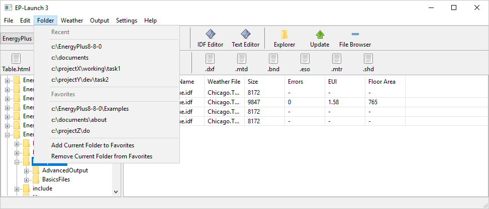
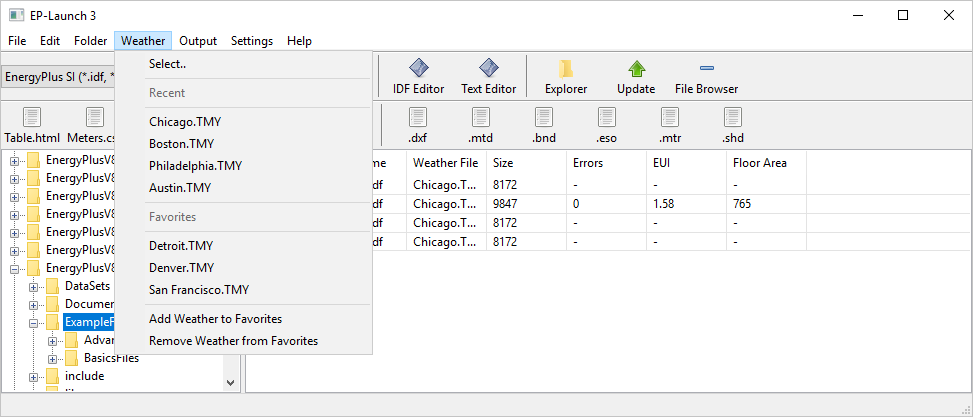

NFP EP-Launch Group Runs
================

**Jason Glazer, GARD Analytics**

 - May 24, 2021

To increase use, the EP-Launch 3 will be enhanced to allow multiple files to be 
run a workflow at once. The classic VB based version of EP-Launch included a 
feature to run a group of simultions by defining the group of files through a 
wizard. While no wizard is planned for EP-Launch 3 some of the capabilities of 
that would be useful.

### Approach

Two different approaches are being considered for supporting multiple files to run
a workflow:

 - simple multiple selection
 - multple selection with group files and group menu

At this point the simple multiple selection approach is favored so that effort 
can also be put on fixing issues and other small enhancements. If time remains,
the use of group files and a group menu will be reconsidered. Since the group
files and group menu builds off the simple multiple selection approach no wasted
effort will occur for them to be done separately.

#### Simple Multiple Selection

The current interface for EP-Launch 3 does not allow shift-clicking a range of files 
or control clicking to select multiple files. This will be changed to allow multiple
files to be selected individually using control-click in turn or by using the 
shift-click and selecting a group at once. The commonly used CTRL-A to select all
files in a folder will also be implemented.

Once multiple files are selected when the "RUN" button is pressed, the currently 
selected workflow will be run on each of the files selected. For workflows that 
require the selection of weather files, if no file is selected, the weather dialog
will open and the selected weather file will be applied to all the files that were
selected that did not already have a weather file associated with them. If files
already have weather files associated with them, those weather file selections 
will be used.

The workflow will be run simultaneously for the multiple files including EnergyPlus
simulations. It is possible that a new setting of the maximum number of simulataneous
processes would be added to the Settings menu.

It would also be beneficial to create a progress indicator that showed how many 
files were selected, have completed, are currently running, and still need to 
complete.

#### Group Files and Group Menu

Building off of the Simple Multiple Selection approach would add the the creation
and management of groups saved as files so that they can be reused. The major 
disadvantage of the Simple Multiple Selection approach is that people often need
to rerun a group of simultions multiple times as the update the files. Without
saving the list of files, this would require the user to reselect the same group
of files each time.

Following the current menus of Folder and Weather, a Group menu would be added. 

The Folder and Weather menus are shown below:

The new GROUP menu would have the following options. 

GROUP
------

- Show Group
- Show Next Folder in Group
- Open Group
- Save Group
- Save Group As..

---

- Add to Group
- Remove from Group
- Change Weather for Entire Group
- Run Group

---

- Recent
- .\test\groupfile1.epg
- .\test\groupfile2.epg
- .\test\groupfile3.epg
- .\test\groupfile4.epg

---

- Favorites
- .\test\groupfile3.epg
- .\test\groupfile4.epg
- Add Group to Favorites
- Remove Group from Favorites

An additional advantage of using the Group menu structure is the ability to add files 
from multiple folders into the same group. The Open Group, Save Group, and Save 
Group As menu items could also be located in the File menu if that design is preferred.
When a group file is selected from Recent or Favorites or by Open Group, the files in 
the current folder will be highlighted. If additional folders also have files in the 
group the Show Next Folder in Group menu item would be active.

### Design Document

Interally, Python "threading" library will probably be used.

The Python "queue" library may be used to manage the threads in a FIFO queue.

